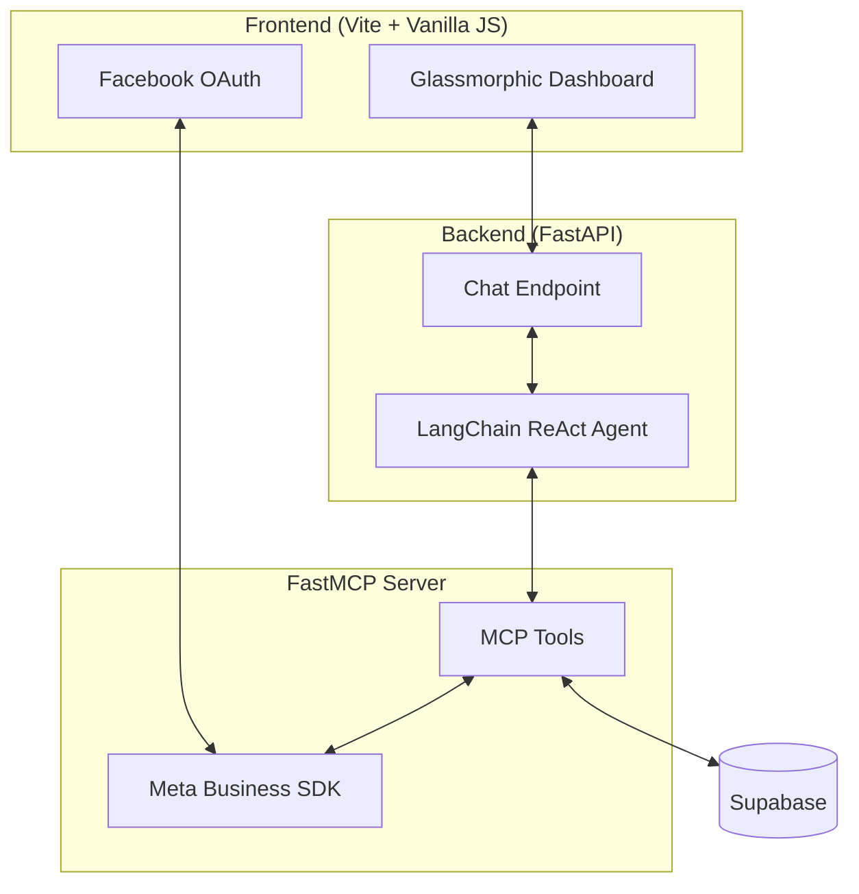

# 🤖 Facebook Shop Agent

A state-of-the-art AI agent designed to manage Facebook Shops with ease. Built with **FastMCP**, **LangChain**, and **FastAPI**, it features a stunning glassmorphic dashboard and seamless integration with the Meta Business SDK and Supabase.

---

## 📺 Demo


---

## 🚀 Key Features

*   **Natural Language Management**: Create products, list orders, and manage shops using an AI assistant.
*   **Secure OAuth Integration**: Robust Facebook Login flow for secure asset management.
*   **High-Performance Backend**: Powered by FastAPI with asynchronous MCP tool execution.
*   **Premium Dashboard**: A modern, responsive UI with a glassmorphism aesthetic.
*   **Robust Data Persistence**: Real-time sync with Supabase for reliable data caching and retrieval.
*   **Multi-modal Capabilities**: Support for image-based product interactions via GPT-4o.

---

## 🏗️ Architecture



---

## 📁 Project Structure

```text
facebook-shop-agent/
├── 📱 frontend/              # Vite-powered SPA with glassmorphic UI
│   ├── js/                   # Auth, API, and View logic
│   └── css/                  # Premium design system
├── ⚙️ backend/               # FastAPI service orchestrating the AI Agent
│   └── main.py               # Main API entry point
├── ⚡ fastmcp/               # FastMCP server & tools
│   ├── server.py             # Tool definitions (Meta SDK + Supabase)
│   ├── agent.py              # CLI version of the LangChain agent
│   └── src/                  # Core logic, database, and Meta SDK wrappers
└── 🎥 Demo.mp4               # Project demonstration video
```

---

## 🛠️ Quick Start

### 1. Prerequisites
- Python 3.11+
- Node.js & npm (for Frontend)
- Meta Developer App (with `catalog_management`, `commerce`, `pages_read_engagement` permissions)
- Supabase Project
- OpenAI API Key

### 2. Backend & FastMCP Setup
```bash
# Clone the repository
git clone https://github.com/rdinesh207/facebook-shop-agent
cd facebook-shop-agent

# Setup virtual environment
python -m venv venv
source venv/bin/activate  # Windows: venv\Scripts\activate

# Install dependencies for FastMCP
cd fastmcp
pip install -r requirements.txt

# Configure environment variables
cp .env.example .env
# Edit .env with your Meta, Supabase, and OpenAI keys

# Setup Database
python setup_db.py

# Install Backend dependencies
cd ../backend
pip install -r requirements.txt
```

### 3. Frontend Setup
```bash
cd ../frontend
npm install
# Configure js/config.js with your Facebook App ID and Backend URL
```

---

## 🏃 Running the Application

### Option A: The Full Stack (Recommended)
1.  **Start the Backend**:
    ```bash
    cd backend
    python main.py
    ```
2.  **Start the Frontend**:
    ```bash
    cd frontend
    npm run dev
    ```
3.  Open `http://localhost:5173` to access the dashboard.

### Option B: FastMCP CLI Agent
```bash
cd fastmcp
python agent.py --inline
```

---

## 🧰 Available AI Tools

| Tool | Description |
| :--- | :--- |
| `create_shop` | Create a new Facebook Shop (product catalog) |
| `get_shop_info` | Retrieve metadata and product counts |
| `create_product_listing` | Add new products to a catalog |
| `list_products` | List and sync products to the database |
| `list_orders` | Manage and sync Facebook Commerce orders |
| `is_product_sold` | Check real-time purchase status of items |

---

## 🛡️ License
MIT License. See [LICENSE](LICENSE) for details.
